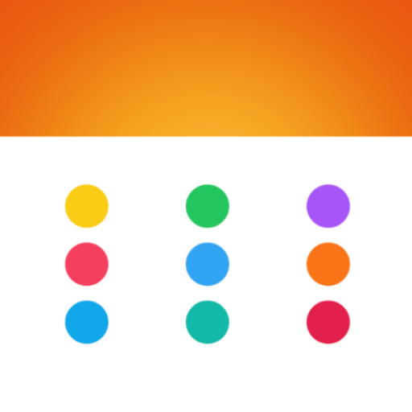
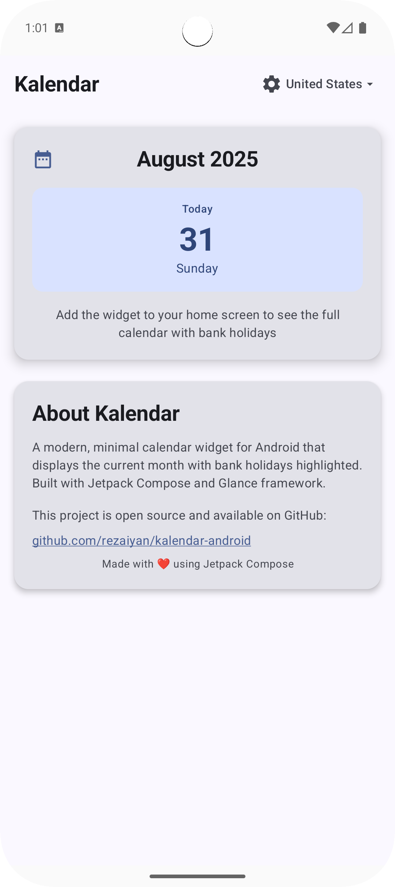
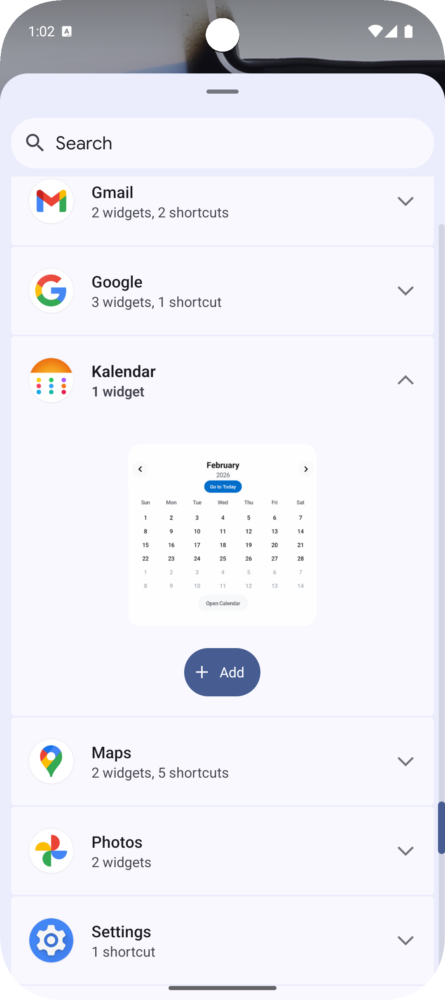
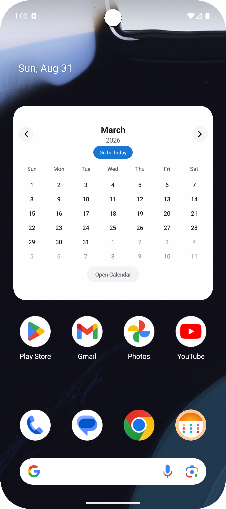

#  Kalendar


A modern, minimal calendar widget for Android that displays the current month with bank holidays highlighted.


## ✨ Features

- **3 Responsive Widget Sizes** - Small, Medium, Large
- **Bank Holidays Support** - 8 countries with automatic highlighting
- **Solar Hijri Calendar** - Full support for Iranian calendar system
- **Modern Design** - Premium, minimal aesthetic with Material Design 3
- **Cross-Calendar Navigation** - Seamless switching between calendar systems
- **Open Source** - Built with Jetpack Compose and Glance framework

## 🌍 Supported Countries & Calendars

### Gregorian Calendar
- 🇺🇸 United States
- 🇬🇧 United Kingdom  
- 🇩🇪 Germany
- 🇫🇷 France
- 🇮🇹 Italy
- 🇦🇺 Australia
- 🇦🇹 Austria

### Solar Hijri Calendar
- 🇮🇷 Iran (Persian Calendar)

## 🎨 Design

- **Modern Minimal** - Clean, uncluttered interface
- **Premium Aesthetics** - Sophisticated color palette and typography
- **Responsive Layout** - Adapts to different screen sizes and orientations
- **Theme Support** - Light and dark mode compatibility

## 🛠️ Technical Stack

- **Jetpack Compose** - Modern UI framework
- **Glance** - Widget framework
- **DataStore** - Preferences storage
- **Kotlin Coroutines** - Asynchronous operations
- **SOLID Principles**


## 📸 Screenshots

| Main App | Widget Preview | Widget |
| -------------- | -------- | ----------------- |
|  |  |  |


## 🚀 Getting Started

### Prerequisites
- Android Studio Arctic Fox or later
- Android SDK 24+
- Kotlin 1.8+

### Installation
1. Clone the repository
```bash
git clone https://github.com/rezaiyan/kalendar-android.git
```

2. Open in Android Studio
3. Build and run

## 🏗️ Architecture

```
app/
├── calendar/           # Calendar system implementations
├── data/              # Data models and repositories
├── widget/            # Widget components and actions
└── ui/                # Main app UI
```

## 🤝 Contributing

We welcome contributions! Please feel free to submit a Pull Request.

## 📄 License

This project is open source and available under the [MIT License](LICENSE).

## 🙏 Acknowledgments

- Made with ❤️ for the Android community
- Persian Date library for Solar Hijri calendar support
- Material Design 3 for modern UI components
